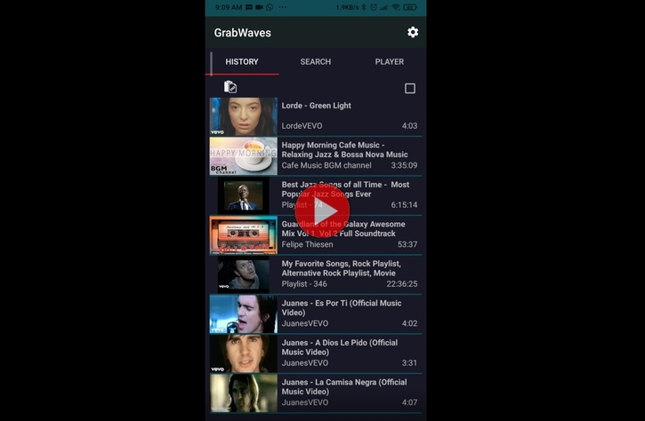

# Grabwaves
Android complement for audioextractor server

Grabwaves is an Android client that works with [Audioextractor server](https://github.com/Javierenrique00/audioextractor), that you can use to browse for youtube music, and listen youtube playlist. Works very fast and without adds. It is open source and uses open sources libraries like exoplayer to listen to music. You can check the code and make changes as you want. Is very usefull to only listen music and youtube like a podcast, because you can block your cell phone and it plays in background to the queue list.

First you need to have access to server of Audioextractor, put the IP in the following form: http://XXX.XXX.XXX.XXX:PPPP  where XXX...XXX is the Ip of the server. and PPPP is the port. Audioextractor use for default 2000 port, but you can change it.

With the option of the min quality, it downloads the music pretty fast without using to many mobile data. With Max quality it uses more mobile data and the music quality is the max available.

To use you need to find first the data that you want to play you can use youtube or using the internal search, then from youtube you can use the share option, then find Grabwaves to share. This creates a link in the History screen of Grabwaves.

Then with all the media in the history tab, you can delete this access by only drag to the right from the center of the music title, you can also listen to music by clicking it and choosing if you want to create a new playlist, or play next to the actual song or at the end of the queue.

In the player you can delete the media also by dragging to the right, you can rearrange song play order by dragging from the image of the song to the new location up or down.

In the search tab you can write the name of the song that you want. Then the results show in the list, you can simply add to the player by clicking, but you can also choose multiple items at the same time by seleting the checkbox in the upper right, an the choose the items. To play select the play icon.

Also in the tab search you can long click in a song or item to search for related videos. You can navigate back with the arrow that points to the left near the search text box.

Download in Gloogle play in:

https://play.google.com/store/apps/details?id=com.mundocrativo.javier.solosonido&hl=en
